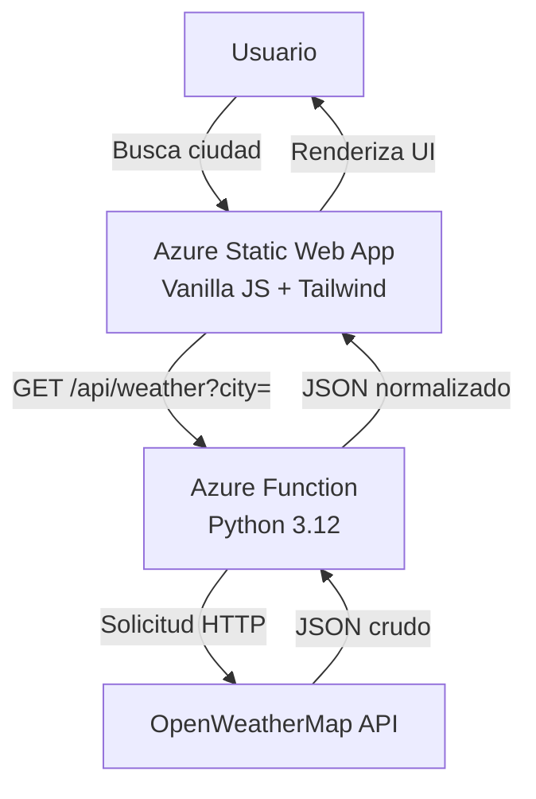

<div align="center">

# Azure Weather Dashboard


### Dashboard meteorológico en tiempo real con arquitectura serverless en Azure

[Ver Demo en Vivo](https://gentle-pond-0d85daf0f.1.azurestaticapps.net) · [Documentación](https://github.com/AndresRJ18/AZURE-Weather) · [Reportar Bug](https://github.com/AndresRJ18/AZURE-Weather/issues)

</div>

---

## Descripción

Aplicación full-stack de consulta meteorológica construida con arquitectura serverless en Azure. Demuestra la integración entre **Azure Functions** (Python) como capa API y **Azure Static Web Apps** para el frontend, conectados mediante CI/CD automático con GitHub Actions.

### Características

- Clima actual con temperatura, sensación térmica, humedad y velocidad del viento
- Pronóstico extendido de 5 días con temperaturas máximas y mínimas
- Modo oscuro/claro con preferencia persistente en localStorage
- Estados de carga y manejo robusto de errores
- Diseño responsivo optimizado para dispositivos móviles y escritorio
- Arquitectura serverless sin servidores que mantener
- Credenciales seguras mediante Azure App Settings

---

## Arquitectura


### Stack Tecnológico

| Capa | Tecnología |
|------|------------|
| **Backend API** | Azure Functions (Python 3.12, HTTP trigger) |
| **Frontend** | Vanilla JavaScript · Tailwind CSS CDN · SPA |
| **Hosting** | Azure Static Web Apps (Free tier) |
| **CI/CD** | GitHub Actions (deploy automático) |
| **API Externa** | OpenWeatherMap (free tier) |

---

## Estructura del Proyecto
```
azure-weather-dashboard/
├── backend/
│   ├── WeatherFunction/
│   │   ├── __init__.py          # HTTP handler + lógica OpenWeather
│   │   └── function.json        # Configuración del trigger HTTP
│   ├── host.json
│   ├── requirements.txt
│   └── local.settings.json.template
├── frontend/
│   ├── index.html               # Single Page Application
│   ├── js/app.js                # Lógica de fetch, render y dark mode
│   └── staticwebapp.config.json # Reglas de routing de SWA
├── .github/workflows/
│   └── deploy.yml               # Pipeline de CI/CD
└── .gitignore
```

---

## Ejecución Local

### Prerrequisitos

- Python 3.12+
- [Azure Functions Core Tools v4](https://learn.microsoft.com/azure/azure-functions/functions-run-local)
- [OpenWeatherMap API Key](https://openweathermap.org/api) (gratis)

### 1. Configurar el Backend
```bash
git clone https://github.com/AndresRJ18/AZURE-Weather.git
cd AZURE-Weather/backend

# Crear entorno virtual
python -m venv .venv
# Windows:
.venv\Scripts\activate
# Linux/Mac:
source .venv/bin/activate

# Instalar dependencias
pip install -r requirements.txt

# Configurar secrets locales (nunca commitear este archivo)
cp local.settings.json.template local.settings.json
# Editar local.settings.json y añadir OPENWEATHER_API_KEY
```

### 2. Iniciar la Function App
```bash
# Dentro de /backend
func start
# API disponible en: http://localhost:7071/api/weather?city=Lima
```

### 3. Servir el Frontend

En una terminal separada:
```bash
cd ../frontend

# Opción 1: Servidor HTTP de Python
python -m http.server 3000

# Opción 2: Con Node.js (si está instalado)
npx serve -p 3000

# Abrir: http://localhost:3000
```

> **Nota:** Para desarrollo local, cambiar temporalmente `API_BASE` en `app.js` a `http://localhost:7071/api/weather`

---

## Deployment en Azure

### Setup Inicial de Recursos (una sola vez)
```bash
# Variables - personalizar estos valores
RG="rg-weather-dashboard"
LOCATION="eastus2"
STORAGE="saweather$(Get-Random -Maximum 9999)"
FUNCAPP="azure-weather-fn"
SWAAPP="swa-weather-dashboard"

# 1. Crear Resource Group
az group create --name $RG --location $LOCATION

# 2. Storage Account (requerido por Azure Functions)
az storage account create `
  --name $STORAGE --resource-group $RG `
  --location $LOCATION --sku Standard_LRS

# 3. Function App (Python 3.12, Consumption plan)
az functionapp create `
  --name $FUNCAPP --resource-group $RG `
  --storage-account $STORAGE `
  --consumption-plan-location $LOCATION `
  --runtime python --runtime-version 3.12 `
  --functions-version 4 --os-type Linux

# 4. Configurar API Key como App Setting (seguro - no en código)
az functionapp config appsettings set `
  --name $FUNCAPP --resource-group $RG `
  --settings "OPENWEATHER_API_KEY=TU_API_KEY_AQUI"

# 5. Static Web App
az staticwebapp create `
  --name $SWAAPP --resource-group $RG `
  --location $LOCATION `
  --source https://github.com/AndresRJ18/AZURE-Weather `
  --branch main `
  --app-location "frontend" `
  --login-with-github

# 6. Configurar CORS en Function App
az functionapp cors add `
  --name $FUNCAPP --resource-group $RG `
  --allowed-origins https://$(az staticwebapp show --name $SWAAPP --resource-group $RG --query defaultHostname -o tsv)
```

### Configurar GitHub Secrets

Ir a **Settings → Secrets and variables → Actions** y añadir:

| Secret | Cómo obtenerlo |
|--------|----------------|
| `AZURE_STATIC_WEB_APPS_API_TOKEN` | `az staticwebapp secrets list --name $SWAAPP --resource-group $RG --query "properties.apiKey" -o tsv` |

### Deployment Manual del Backend

El backend se deploya manualmente usando Azure Functions Core Tools:
```bash
cd backend
func azure functionapp publish azure-weather-fn --python
```

### Deploy del Frontend

El frontend se deploya automáticamente mediante GitHub Actions al hacer push a `main`:
```bash
git add .
git commit -m "feat: initial deployment"
git push origin main
```

---

## Aprendizajes Clave

- **Azure Static Web Apps + Function App** proporcionan routing `/api/*` automático sin necesidad de configurar CORS adicional o API Gateway
- **Azure Functions Consumption plan** ofrece aproximadamente 1 millón de ejecuciones gratuitas por mes, ideal para proyectos de portafolio
- **Separación de secrets** mediante Azure App Settings mantiene las credenciales fuera del control de versiones
- **Respuestas API normalizadas** en la capa de Function desacoplan el frontend de cambios en APIs externas
- **GitHub Actions** con `Azure/static-web-apps-deploy` habilita deployments automáticos sin intervención manual

---

## Autor

**Andrés Rodas**  
Estudiante de Ingeniería Informática — Universidad Peruana Cayetano Heredia (UPCH)  
Especialización en Cloud Computing e Inteligencia Artificial

[](https://www.linkedin.com/in/andres-rodas-802309272)
[](https://github.com/AndresRJ18)
[](mailto:andrescloud18sj@gmail.com)

---

## Licencia

Este proyecto está licenciado bajo la Licencia MIT. Consulta el archivo [LICENSE](LICENSE) para más detalles.

---

<div align="center">

Si este proyecto te resultó útil, considera darle una estrella en GitHub

[Volver al inicio](#azure-weather-dashboard)

</div>